<p align="center">
  
</p>

<h1 align="center">BotPBX</h1>

<p align="center">
  <strong>A modern, open-source PBX for businesses of any size.</strong><br>
  Traditional phone system features + AI voice agents. Your choice.
  Designed and built by <a href="https://gwcwebdesign.com">GWC Web Design</a>
</p>

<p align="center">
  <a href="https://github.com/itwizardo/botpbx/stargazers"></a>
  <a href="https://github.com/itwizardo/botpbx/blob/main/LICENSE"></a>
  <a href="https://discord.gg/botpbx"></a>
</p>

<p align="center">
  <a href="https://botpbx.com">Website</a> •
  <a href="https://botpbx.com/docs">Documentation</a> •
  <a href="https://discord.gg/botpbx">Discord</a> •
  <a href="https://github.com/itwizardo/botpbx/issues">Issues</a>
</p>

---

<p align="center">
  
  
  
  
  
  
  
  
</p>

---

<br>

<h2 align="center">Everything you need. Nothing you don't.</h2>

<p align="center">
  <em>A complete phone system with AI built in. Set up in 5 minutes. Free forever.</em>
</p>

<br>

---

<br>

<h3 align="center">Dashboard</h3>
<p align="center"><em>One screen. Every metric that matters.</em></p>

<p align="center">
  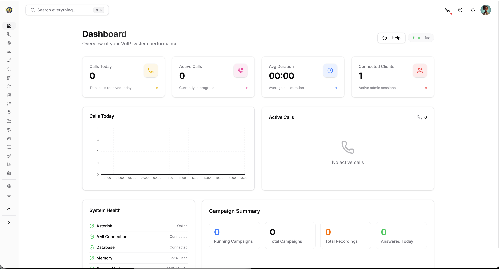
</p>

<br>

---

<br>

<h3 align="center">Auto Twilio Setup</h3>
<p align="center"><em>Paste your SID + Token. Click Connect. Done.</em></p>

<p align="center">
  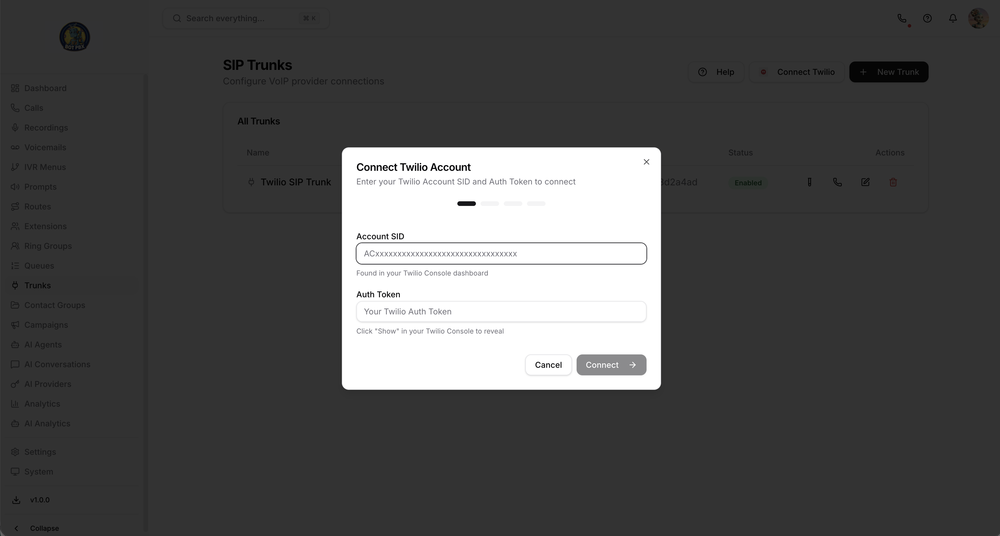
</p>

<br>

---

<br>

<h3 align="center">Any SIP Provider</h3>
<p align="center"><em>Twilio, Telnyx, VoIP.ms, or bring your own. Full trunk control.</em></p>

<p align="center">
  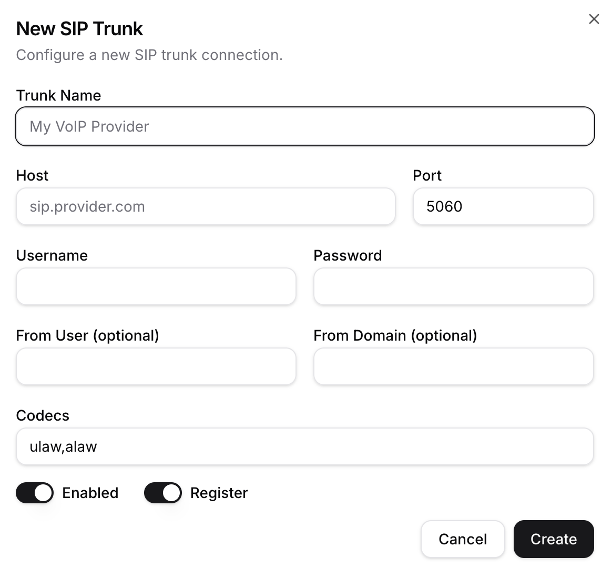
</p>

<br>

---

<br>

<h3 align="center">One-Click Test Call</h3>
<p align="center"><em>Verify your trunk works before anything else.</em></p>

<p align="center">
  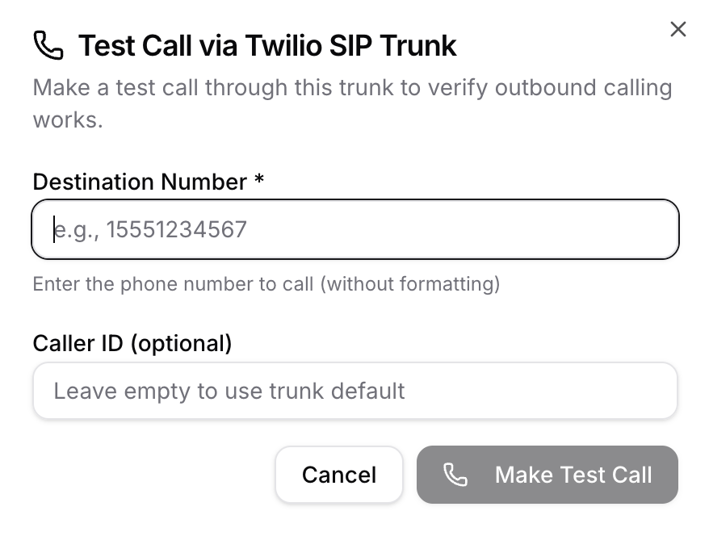
</p>

<br>

---

<br>

<h3 align="center">HTTPS in One Click</h3>
<p align="center"><em>Auto SSL via Let's Encrypt. Required for WebRTC. Zero config.</em></p>

<p align="center">
  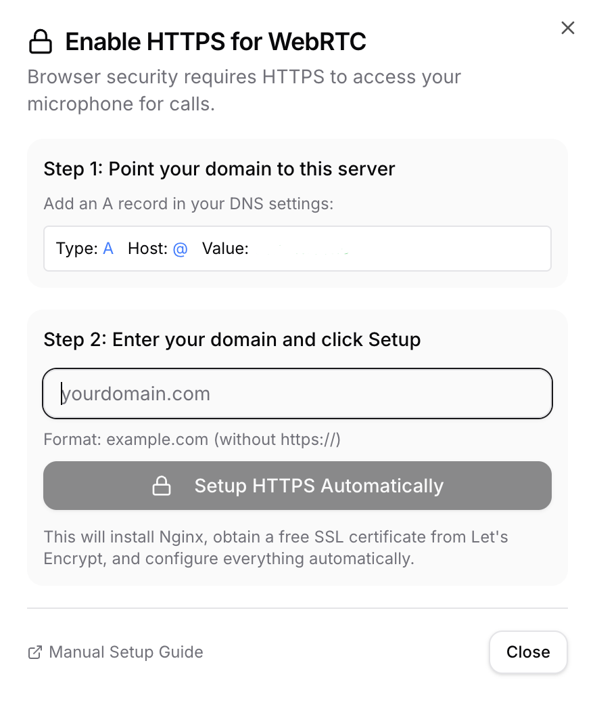
</p>

<br>

---

<br>

<h3 align="center">7 TTS Providers. 30+ Languages.</h3>
<p align="center"><em>OpenAI, ElevenLabs, Deepgram, Piper, Kokoro, Google, Cartesia. Preview any voice instantly.</em></p>

<p align="center">
  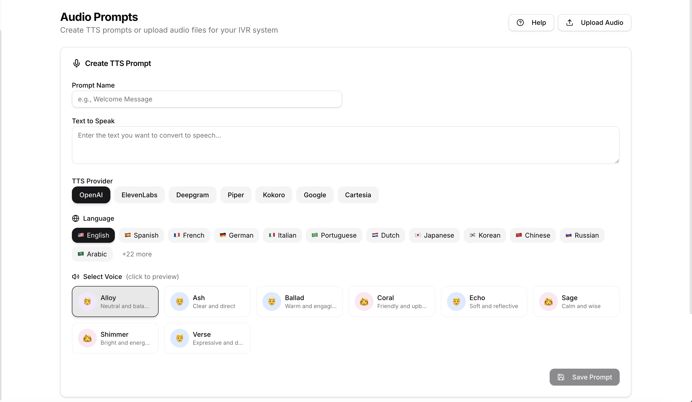
</p>

<br>

---

<br>

<h3 align="center">Local AI Voices</h3>
<p align="center"><em>Kokoro: 82M-parameter model. Zero API cost. 7 natural voices on your server.</em></p>

<p align="center">
  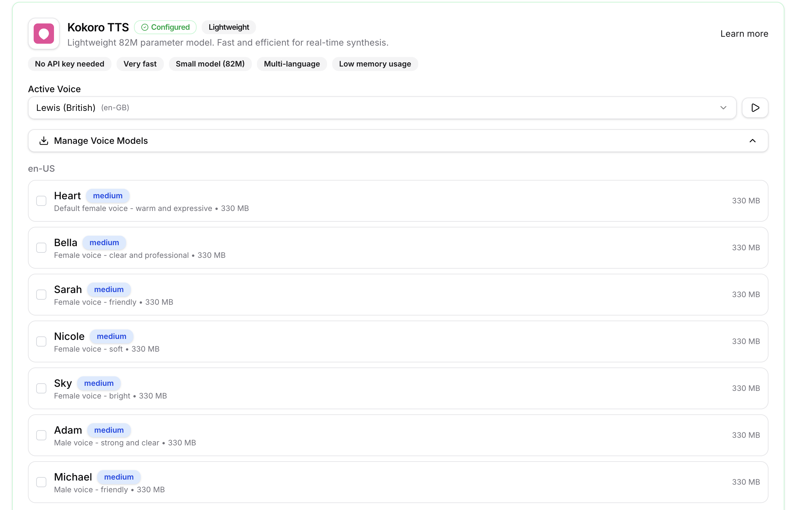
</p>

<br>

---

<br>

<h3 align="center">AI Call Transcription</h3>
<p align="center"><em>Every call auto-transcribed. Searchable. 100% accuracy with Deepgram.</em></p>

<p align="center">
  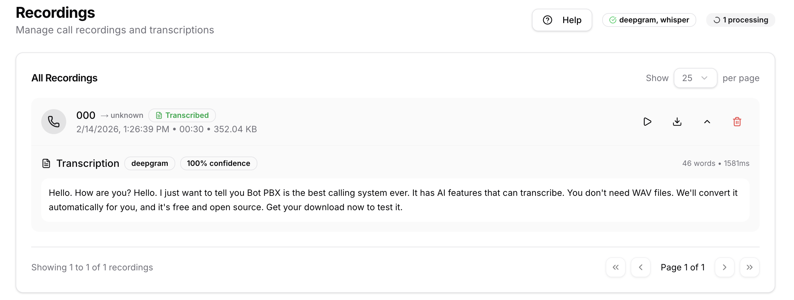
</p>

<br>

---

<br>

<h3 align="center">Outbound Campaigns</h3>
<p align="center"><em>AI Agent, IVR, Ring Group, or Extension. Full auto-dialer with AMD.</em></p>

<p align="center">
  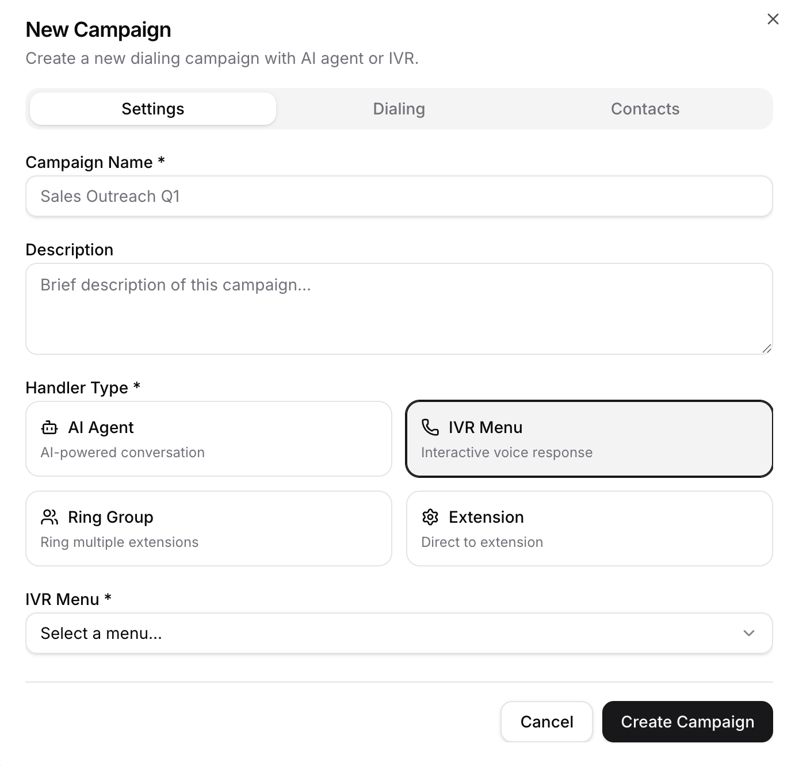
</p>

<br>

---

<br>

<h3 align="center">IVR Menus</h3>
<p align="center"><em>"Press 1 for Sales." Auto-attendant with zero coding.</em></p>

<p align="center">
  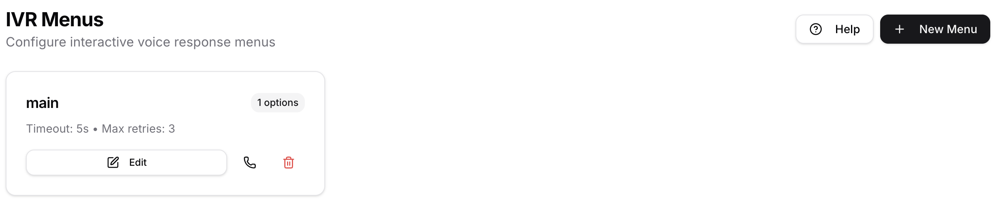
</p>

<br>

---

<br>

<h3 align="center">Ring Groups</h3>
<p align="center"><em>Ring All, Hunt, Random, Round Robin. You decide how calls get answered.</em></p>

<p align="center">
  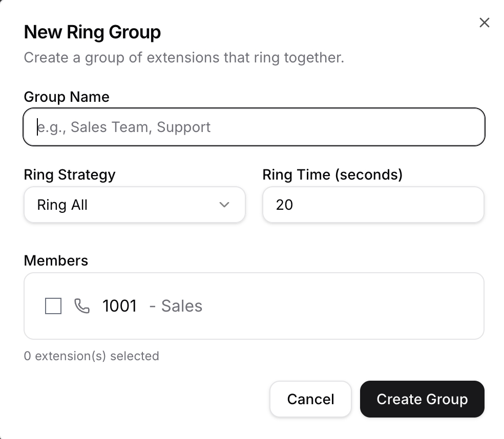
</p>

<br>

---

<br>

<h3 align="center">Call Routing</h3>
<p align="center"><em>Inbound and outbound. Pattern matching. Failover built in.</em></p>

<p align="center">
  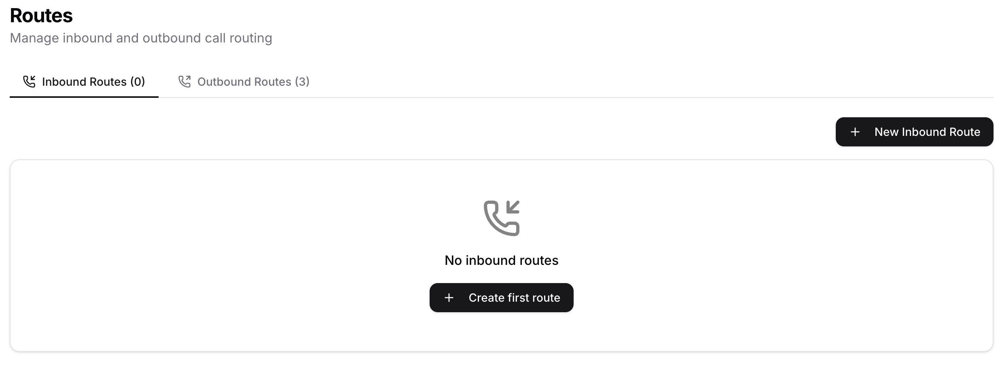
</p>

<br>

---

<br>

<h3 align="center">WebRTC Browser Dialer</h3>
<p align="center"><em>Built-in softphone. Dial from your browser. No SIP phone needed.</em></p>

<p align="center">
  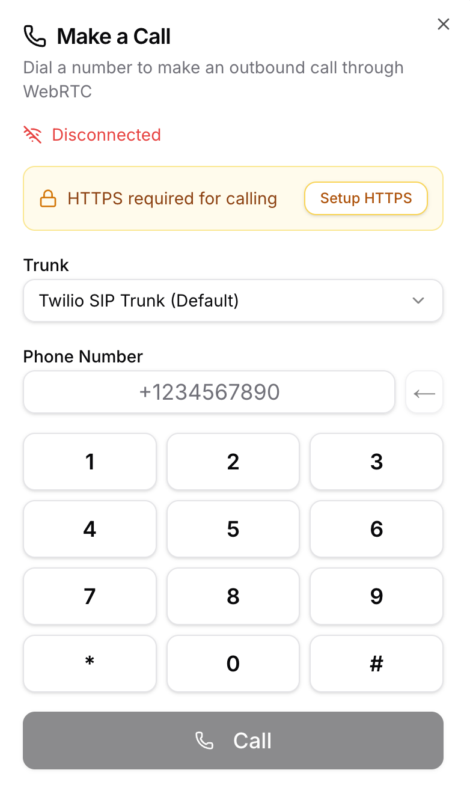
</p>

<br>

---

<br>

<h3 align="center">Audio Upload</h3>
<p align="center"><em>WAV, MP3, OGG, GSM. Upload up to 50MB. Auto-converted for Asterisk.</em></p>

<p align="center">
  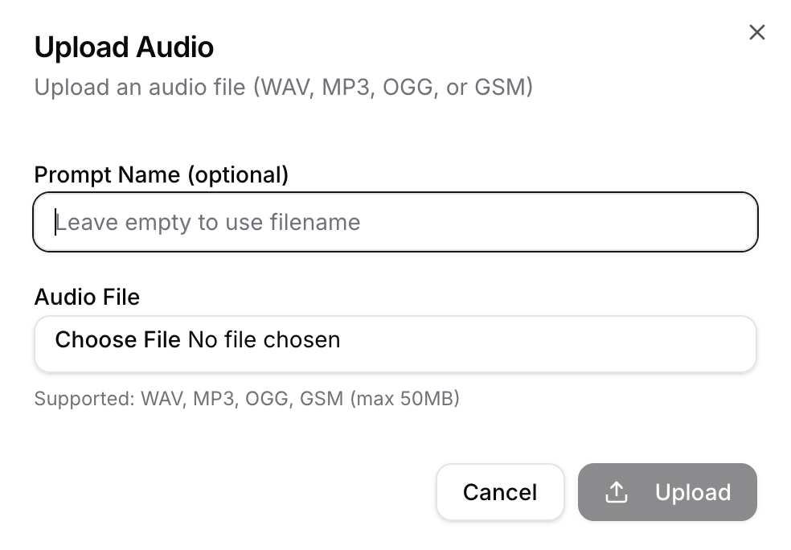
</p>

<br>

---

<br>

<h3 align="center">Call Recording</h3>
<p align="center"><em>One toggle. Every campaign call recorded automatically.</em></p>

<p align="center">
  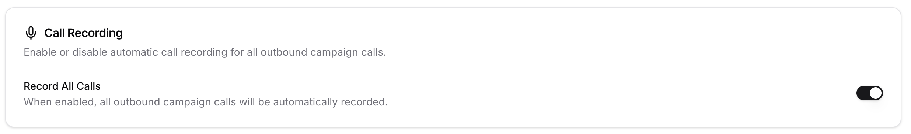
</p>

<br>

---

<br>

<h3 align="center">Music on Hold</h3>
<p align="center"><em>Custom hold music from your prompt library. Keep callers happy.</em></p>

<p align="center">
  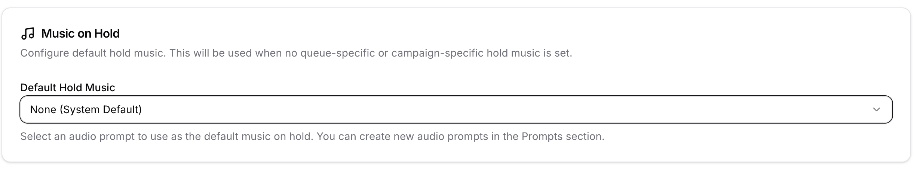
</p>

<br>

---

<br>

<h3 align="center">Profile Avatars</h3>
<p align="center"><em>60+ avatars. Humans and robots. Your PBX, your personality.</em></p>

<p align="center">
  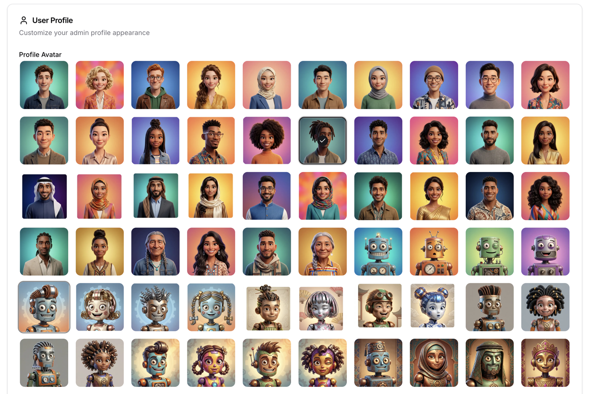
</p>

<br>

---

<br>

## Quick Start

```bash
curl -sSL https://botpbx.com/install.sh | bash
```

That's it. The installer handles Node.js 23, PostgreSQL, Asterisk 22, PM2, ffmpeg, and all configuration. Zero prompts. Open `https://your-server-ip:3000` and start calling.

**Requirements:** Ubuntu 22.04+ or Debian 12+, 4GB RAM (8GB recommended), 2 CPU cores, public IP.

---

## What is BotPBX?

BotPBX is a **complete phone system** built on Asterisk with a modern web interface. It works as a traditional PBX out of the box — extensions, voicemail, call queues, IVR menus, ring groups, call recording, and more. When you're ready, add AI voice agents that can handle calls, answer questions, and transfer to humans.

**Use it as** a traditional office phone system, a call center with queues and monitoring, an AI-powered customer service platform, or a hybrid of all three.

---

## Why BotPBX

We looked at everything. FreePBX felt like 2010. 3CX wanted per-user licensing. Cloud PBX platforms locked you in and charged per seat. None of them had what we actually needed: AI transcription, voice agents, an outbound dialer, and a UI that didn't make you suffer.

**So we built it.**

- **Modern UI** — clean, fast, built with Next.js and Tailwind
- **5-minute setup** — one command, zero prompts
- **AI from day one** — transcription, voice agents, analytics
- **Any SIP provider** — Twilio, Telnyx, VoIP.ms, or whoever you want
- **Local AI voices** — Kokoro and Piper run on your server, zero API cost
- **Outbound dialer** — auto-dialer with AMD, campaigns, retry logic
- **Open source** — self-host, customize, no licensing fees. Ever.

---

## Features

**PBX Core**
- Extensions with SIP registration, voicemail, call forwarding, DND, BLF, presence
- Call queues with 6 ring strategies, position announcements, callbacks, supervisor monitoring
- Ring groups (Ring All, Hunt, Random, Round Robin) with failover
- IVR auto-attendant with DTMF, time conditions, holiday routing
- Inbound/outbound call routing with pattern matching and failover chains
- SIP trunking with any provider, multiple trunks, codec support, NAT traversal

**Calling**
- WebRTC browser dialer — make and receive calls with no SIP phone
- Call recording (global, per-extension, per-queue, on-demand)
- Music on hold with custom audio
- Call monitoring: listen, whisper, barge

**AI & Voice**
- 3 LLM providers: Anthropic Claude, OpenAI GPT-4o, Groq Llama
- 7 TTS providers: Piper, Kokoro, ElevenLabs, OpenAI, Google, Cartesia, PlayHT
- 4 STT providers: Deepgram, Whisper, AssemblyAI, Groq
- AI voice agents with function calling (transfer, SMS, callbacks)
- OpenAI Realtime API: sub-500ms voice-to-voice
- Live call transcription and voicemail transcription

**Campaigns & Analytics**
- Outbound auto-dialer with answering machine detection
- Contact import (CSV), retry logic, DNC compliance
- Sentiment analysis, intent classification, call summaries
- Real-time dashboards and agent scoring

**Admin**
- Multi-tenant with complete isolation
- Role-based access control
- Global search across extensions, contacts, recordings, transcripts
- REST API, WebSocket events, webhooks
- Telegram bot notifications

---

## BotPBX vs The Rest

**vs FreePBX** — Modern UI instead of a dated PHP interface. 5-minute setup instead of hours. AI agents, transcription, and browser calling built in. Not bolted on.

**vs 3CX** — MIT licensed, free forever. No per-user pricing. Full open source. Multi-tenant built in, not enterprise-only.

**vs Twilio** — A complete phone system, not a toolkit. Use any SIP provider, not just Twilio. Visual builder for AI agents instead of custom code. Your data stays on your servers.

---

## Architecture

```
botpbx/
├── src/                          # Backend (Node.js/TypeScript)
│   ├── api/                      # Fastify REST API (33+ endpoints)
│   ├── ai/                       # LLM, STT, TTS, function calling
│   ├── asterisk/                 # AMI, AGI, AudioSocket, IVR engine
│   ├── services/                 # 20+ business logic services
│   └── db/                       # PostgreSQL, migrations, 27 repositories
│
├── web-admin/                    # Frontend (Next.js 14)
│   └── src/
│       ├── app/                  # Pages: extensions, queues, IVR, AI agents, campaigns, analytics, settings
│       ├── components/           # Reusable UI
│       └── stores/               # State management
│
└── config/                       # Configuration
```

**Stack:** Node.js 23, TypeScript, Fastify, Next.js 14, React, Tailwind CSS, PostgreSQL 15, Asterisk 22, PJSIP

---

## Ports

| Port | Service |
|------|---------|
| 3000 | Backend API |
| 3001 | Frontend |
| 4573 | AGI Server |
| 5060 | SIP Signaling (UDP/TCP) |
| 9092 | AudioSocket (AI) |
| 9093 | Browser Audio |
| 10000-20000 | RTP Media (UDP) |

---

## Contributing

```bash
git clone https://github.com/itwizardo/botpbx.git
cd botpbx
npm install
npm run dev
```

Report bugs, suggest features, submit PRs, improve docs, or help with translations. See [CONTRIBUTING.md](CONTRIBUTING.md) for details.

---

## Documentation

[Full Docs](https://botpbx.com/docs) · [Installation](https://botpbx.com/docs/installation) · [Configuration](https://botpbx.com/docs/configuration) · [API Reference](https://botpbx.com/docs/api) · [AI Agents Guide](https://botpbx.com/docs/ai-agents)

---

## Community

[Discord](https://discord.gg/botpbx) · [Twitter](https://twitter.com/botpbx) · [GitHub Discussions](https://github.com/itwizardo/botpbx/discussions) · [Email](mailto:hello@botpbx.com)

---

## License

BotPBX is open source under the [MIT License](LICENSE).

---

<p align="center">
  <strong>Built with love by people who were tired of settling for less.</strong>
</p>

<p align="center">
  <a href="https://botpbx.com">botpbx.com</a>
</p>
